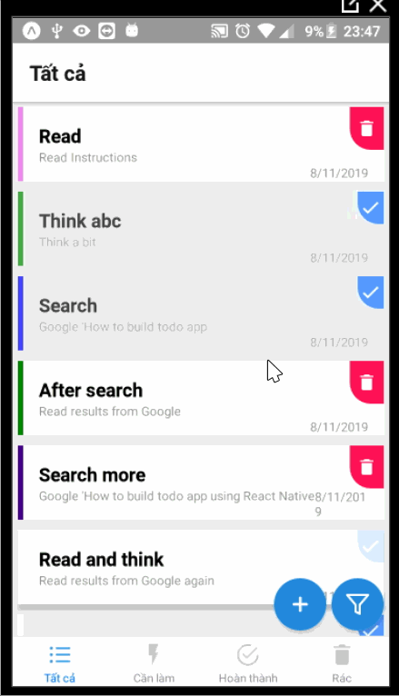

# # Todo List - Expo React Native

  

This is an simple react native app about **Todo List**.

  

**Time spent:** 24 hours spent in total

  

Completed user stories:

  Accomplishments 🥇🏆💯:

*  [x] User can see a list of their todos.

*  [x] User can toggle a todo's status of active/done.

*  [x] User can see a different color todo background based on the todo's status.

*  [x] When a user toggles a todo, they're directed to an individual todo screen.

*  [x] If the user's todo list is too long, they can continue scrolling so they can see the input to add a new todo.

*  [x] User can add a new todo by entering it and submitting.

*  [x] User will see the input reset when they submit their todo.

Rockets 🚀

*  [x] User can see completed todos on the CompleteScreen.

*  [x] User can see active todos on the ActiveScreen.

*  [x] User can delete a todo delete button.

*  [x] User can cancel deleting a todo.

*  [x] User can see todo deleted in trash screen.

  

**Walk through of app:**

  

  

GIF created with [LiceCap](http://www.cockos.com/licecap/).

  
  

**How to install:**

  

1. Create a [blank Expo Project](https://hoangtran0410.github.io/CoderSchool_Courses/TutorialPrepare)

2. Download all folders and files in this **RockPaperScissors** repository

3. Copy and paste to blank Project you have created
